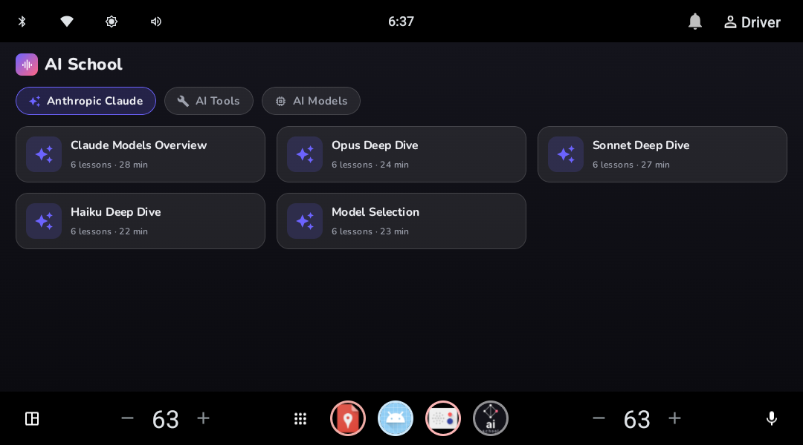
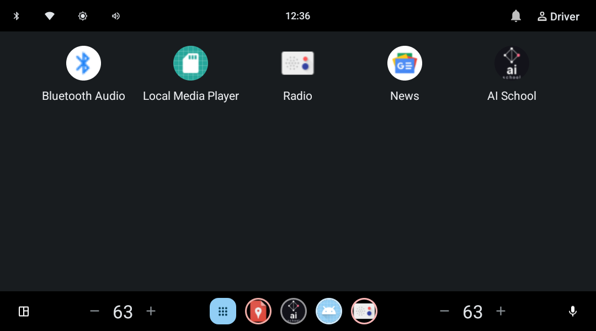
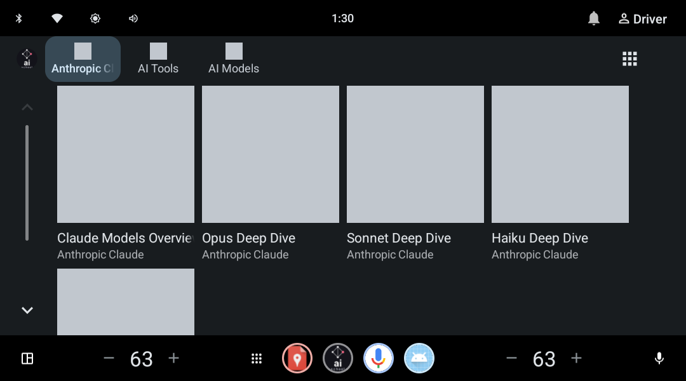
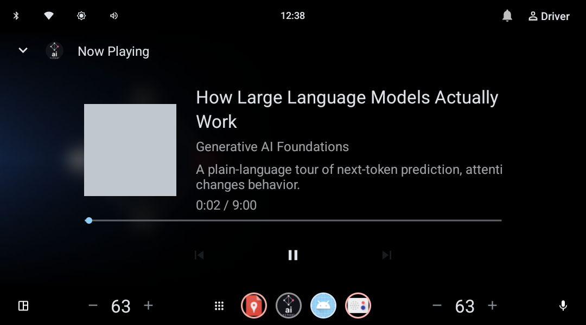
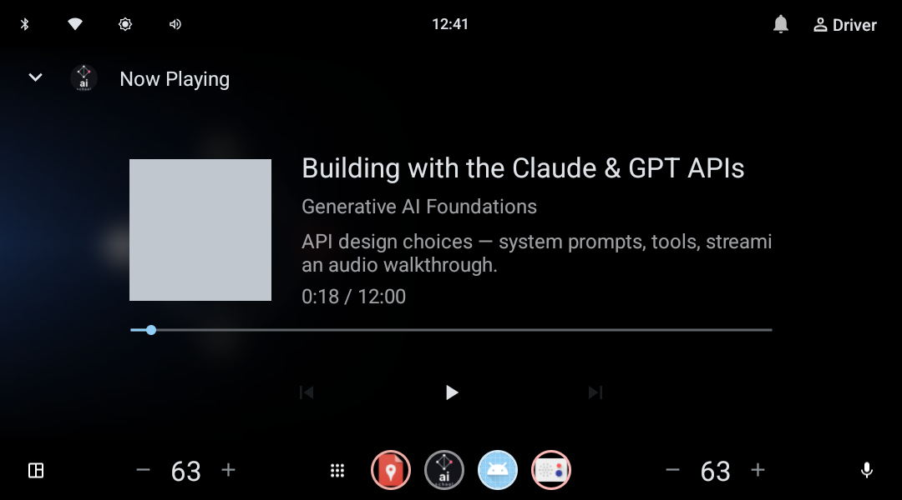
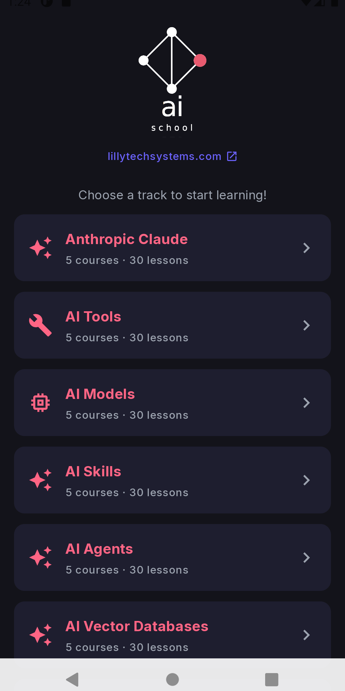
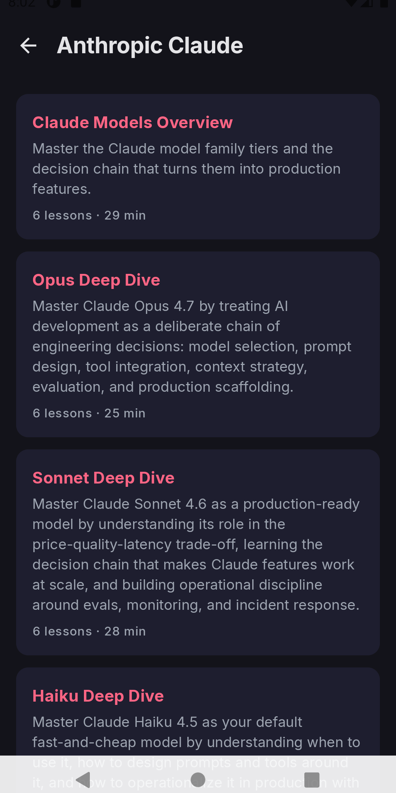
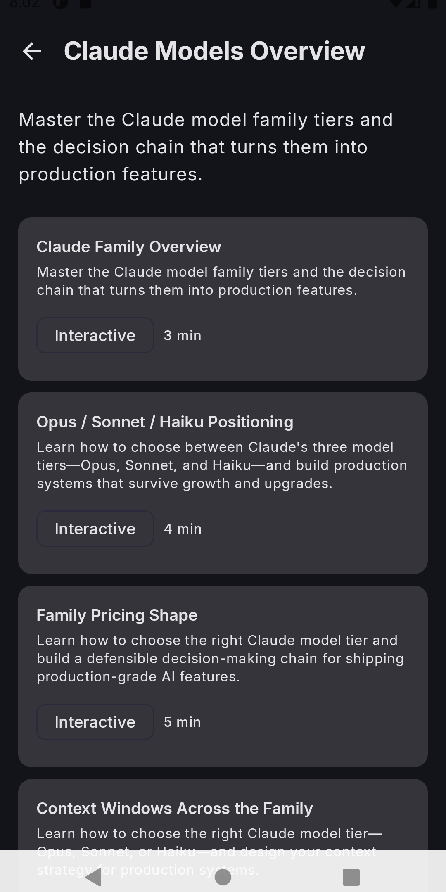
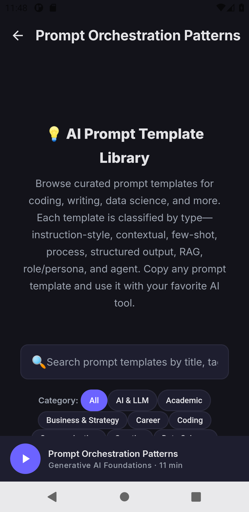

<div align="center">

# AI School · Android &amp; iOS

**A dual-flavor Android app for the AI School learning platform (rich and interactive on a phone, strictly audio-only and distraction-safe in the car), plus a native SwiftUI iOS app.**

[Architecture](docs/ARCHITECTURE.md) · [Run guide](docs/RUNNING.md) · [iOS app](ios/) · [Demo video](docs/automotive-demo.mp4) · [Screenshots](#screenshots) · [Build](#build)

</div>

---

AI School is a learning platform for AI and software topics
(lillytechsystems.com/ai-school). This project explores how that content can live
safely inside a vehicle. The same domain model renders as a full interactive app
on mobile, but the moment a lesson heads for a vehicle the **data layer** strips
every visual payload, so the cabin sees audio plus a short spoken summary only.
Safety is enforced by architecture, not by UI review.

The anchor feature: **the lesson auto-pauses the instant a window is opened**,
driven directly off the Vehicle HAL.

## Highlights

- **Driver-distraction safe by design** · the automotive flavor is a
  `MediaBrowserService` with no UI of its own; the car's Media Center renders
  everything, and visually dense lessons are sanitized to audio in the data layer.
- **Window-open auto-pause / window-closed auto-resume (VHAL)** · a
  `CarPropertyManager` callback on `WINDOW_POS` pauses playback through the media
  session the moment any window leaves the closed position, and resumes once every
  window is closed again (only if the window paused it). Systemic, not a local hack.
- **Offline-resilient** · streaming first, bundled-narration fallback, seeded
  catalog. The cabin never depends on connectivity.
- **OEM-themable + a VW-styled preview** · the production in-car UI is OEM-themed
  via car-ui-lib; a Compose preview shows AI School in the VW MIB design language.
- **Live interactive lessons on mobile** · code, sandboxes, and the real
  published site rendered in-app.

## Screenshots

### Android Automotive OS


| Source picker | Browse | Now Playing | Window-open auto-pause |
|---|---|---|---|
|  |  |  |  |

> **Why the first image looks "VW" and the rest look plain:** the top image is the
> app-drawn `VwCatalogActivity` design preview, which the app styles itself. The
> four screens below are the real driver-facing UI, which the **car's Media Center**
> renders, not the app, so on the emulator they appear in the stock AOSP theme. On
> a real VW head unit those same screens would be VW-themed automatically via the
> OEM's car-ui-lib overlays, with no app changes. This app/OEM boundary is by
> design (details in [docs/ARCHITECTURE.md](docs/ARCHITECTURE.md)).

### Mobile
| Catalog | Course | Audio lesson | Interactive lesson |
|---|---|---|---|
|  |  |  |  |

A 26-second captioned walkthrough is at
[`docs/automotive-demo.mp4`](docs/automotive-demo.mp4).

## Architecture

A multi-module Gradle (Kotlin DSL) monorepo:

| Module | Role |
|---|---|
| `:core:model` | Domain entities, catalog, and the content-safety rules |
| `:core:network` | Ktor client with dual-payload handling (visual vs audio-only) |
| `:core:demoaudio` | Bundled narration + branded artwork for offline use |
| `:app-mobile` | Jetpack Compose app (catalog, audio + interactive lessons) |
| `:app-automotive` | Media browser service, VHAL cabin monitor, VW-styled preview |

The full design write-up, sequence diagrams, and branding/theming notes are in
[docs/ARCHITECTURE.md](docs/ARCHITECTURE.md); setup and run steps are in
[docs/RUNNING.md](docs/RUNNING.md).

## iOS (SwiftUI)

A native SwiftUI port of the mobile experience lives in [`ios/`](ios/): the same
catalog, courses, and lessons, with an `AVPlayer` audio player (bundled offline
narration), a `WKWebView` for interactive lessons, and the same live-feed with
seed fallback. It also ships a **CarPlay** audio scene, the iOS analog of the
Android Automotive flavor (audio-only browse plus Now Playing). See
[`ios/README.md`](ios/README.md) to build and run.

## Build

Requires a current Android Studio with the Android 36 SDK and JDK 17+. The Gradle
project lives in [`android/`](android/) (the iOS app is in [`ios/`](ios/)).

```bash
cd android

# Mobile (phone/tablet emulator, API 26+)
./gradlew :app-mobile:assembleDebug

# Automotive (Android Automotive emulator, API 29+)
./gradlew :app-automotive:assembleDebug
```

Pre-built debug APKs are in [`android/release/`](android/release/). Run
`:app-automotive` on an
Automotive emulator; AI School then appears in the Media Center. To exercise the
window-pause on an emulator while a lesson plays:

```bash
adb shell cmd car_service inject-vhal-event WINDOW_POS 0x10 3   # open driver window -> pause
adb shell cmd car_service inject-vhal-event WINDOW_POS 0x10 0   # close it -> resume
```

`CONTROL_CAR_WINDOWS` is privileged: on an OEM or platform-signed build it is
granted and the feature is live; otherwise the monitor disables itself cleanly.
The automotive debug build is signed with the **public AOSP platform test key**
(`android/app-automotive/keystore/`) so the feature runs on `test-keys` emulator images.

## Tech stack

Kotlin · AGP 9.2 · Jetpack Compose · Ktor 3 · `MediaBrowserServiceCompat` /
`MediaSessionCompat` · `android.car` · compileSdk 36.

Fonts: Inter and Nunito (SIL Open Font License). The AI School knowledge-graph
mark and brand assets belong to Lilly Tech Systems.

## Note on platform fit

Android Automotive OS is used here as a representative software-defined-vehicle
surface. The decisions on display are platform-agnostic: a content-safety policy
in the data layer, live vehicle-signal integration, an offline strategy, and a
clean boundary between app brand and OEM chrome. Those patterns carry onto any
modern software-defined-vehicle stack, including a CARIAD or MIB environment.

## License

See [LICENSE](LICENSE). Demo / evaluation use; brand assets are property of
Lilly Tech Systems.
