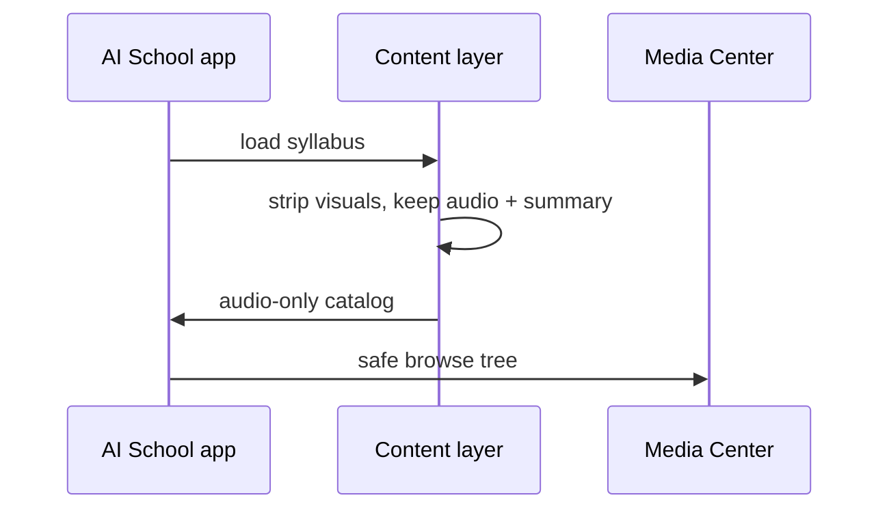
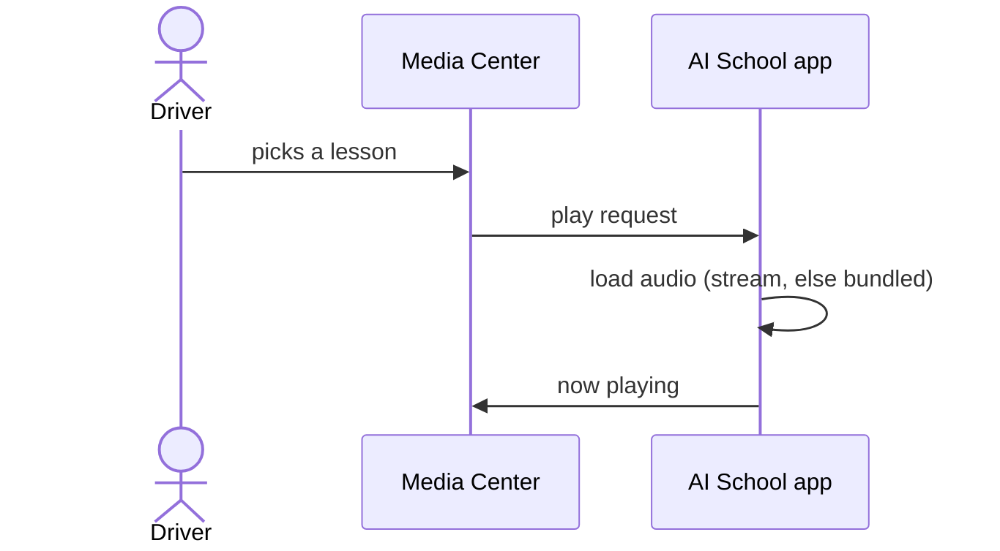
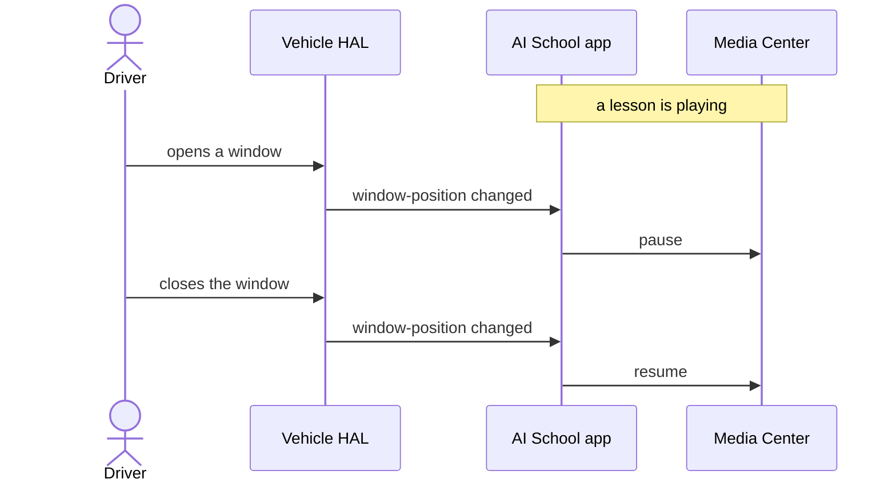

# AI School on Android Automotive OS: Architecture

A concept build for driver-safe in-car learning. AI School is a learning platform
for AI and software topics (lillytechsystems.com/ai-school); this project explores
how that content can live safely inside a vehicle as a dual-flavor Android app:
rich and interactive on a phone, strictly audio-only and distraction-safe in the
car.

It is a working build, not slideware. This doc covers the architecture, the
in-vehicle design decisions, the core flows as sequence diagrams, and the
branding/theming boundary. For setup and run steps see [RUNNING.md](RUNNING.md).

---

## At a glance

| | Mobile (`:app-mobile`) | Automotive (`:app-automotive`) |
|---|---|---|
| Surface | Phone / tablet | Android Automotive OS head unit |
| UI | Full Jetpack Compose app | None of its own; rendered by the car's Media Center |
| Content | Video, code, interactive sandboxes, audio | Audio streams plus short spoken summaries only |
| Headline feature | Live interactive lessons from the production site | Window-open auto-pause via the Vehicle HAL |

Both flavors are driven by one shared domain model, so the catalog stays
consistent across surfaces and the in-car rules are enforced in data, not UI.

---

## Modules: one syllabus, two surfaces

A small multi-module monorepo:

- `:core:model` · domain entities (Course, Lesson), the catalog, and the
  content-safety rules
- `:core:network` · Ktor client with dual-payload handling (a visual payload for
  mobile, an audio-only payload for the car)
- `:core:demoaudio` · bundled narration so the experience works with no network
- `:app-mobile` · the rich Compose app
- `:app-automotive` · the media service, the cabin-signal integration, and a
  VW-styled design preview

The guiding principle: the same lesson renders as a rich interactive unit on a
phone, but the moment it heads for a vehicle the **data layer** strips every
visual payload. Lessons that are visually dense (code, raw JSON, architecture
diagrams) survive in the cabin only as an audio stream plus a one-line summary.
Safety is enforced by architecture, not by UI review.

---

## In-vehicle design decisions

**1. The app brings content, not chrome.**
The automotive flavor declares no activities for the driving experience. It is a
`MediaBrowserServiceCompat`, so the vehicle's own distraction-optimized Media
Center renders the browse tree and the Now Playing screen. There is no app-drawn
text entry, clipboard, or free-form UI in the cabin.

**2. Content is sanitized in the data layer.**
The audio-only catalog is produced by a single transform: drop visual payloads,
keep the audio stream and the spoken summary, and drop anything with no audio. The
browse tree the head unit receives is structurally incapable of presenting
distracting content.

**3. The cabin is an input: window-open auto-pause, window-closed auto-resume.**
A `CarPropertyManager` callback subscribes to `WINDOW_POS` across every cabin
window zone. When any window leaves the fully-closed position, playback is paused
through the media session's transport controls, so the IVI, the steering-wheel
state, and any connected surface all update together. Once every cabin window is
closed again, the lesson resumes automatically. It is a systemic pause/resume, not
a local workaround. The resume is guarded: only a lesson the window paused
resumes, never one the driver paused by hand. Details:

- Uses the current `subscribePropertyEvents` API with a fallback to the legacy
  callback for older Car API levels.
- Reads `WINDOW_POS` (`0` = closed, any non-zero value = cracked or open) per zone
  (driver, front passenger, rear-left, rear-right).
- `CONTROL_CAR_WINDOWS` is a privileged permission. On an OEM or platform-signed
  build it is granted and the feature is live; on a regular install the monitor
  detects the missing permission and disables itself cleanly, so playback and
  browsing are unaffected.
- The callback is unregistered and the Car connection released on teardown.

**4. Offline-resilient.**
Streaming is attempted first; if it is unreachable, bundled narration plays
seamlessly. The catalog falls back to a built-in copy. The cabin experience never
depends on connectivity.

---

## Core flows (sequence diagrams)

Three simple flows, in the order they happen: content is made safe, a lesson
plays, then the cabin reacts.

### 1. Content made safe for the cabin

Before content reaches the car, the data layer strips every visual payload and
keeps audio plus a one-line summary. Source: `android/core/model/AutomotiveSafety.kt`.



### 2. Lesson playback

The car's Media Center drives playback; the app supplies the audio. Source:
`AISchoolMediaService.kt`, `BrowseTree.kt`.



### 3. Window-open pause, window-closed resume (the anchor feature)

A lesson pauses the instant a window opens, and resumes once every window is
closed again. Source: `CabinWindowMonitor.kt`, `AISchoolMediaService.kt`.



To exercise the window flow on an emulator, see [RUNNING.md](RUNNING.md).

---

## Branding and head-unit theming

Two distinct layers: what the **app** brands (we control) and what the **OEM**
themes (the vehicle maker controls). The boundary between them is an important
architectural distinction in any AAOS app.

### Why some screens look "VW" and some do not

There are two kinds of screens in the automotive flavor, and they are styled by
different owners. This is intentional, not an inconsistency:

- **App-drawn screens look VW-styled.** The `vw.VwCatalogActivity` preview (home,
  pill tabs, course tiles, Now Playing with progress) is Compose UI the app
  renders itself, deliberately styled after VW MIB (dark canvas, Nunito, accent
  colors).
- **The real driver-facing screens are drawn by the car, not the app.** The
  source picker, the browse grid, the lesson lists, and the actual Now Playing are
  rendered by the AAOS Media Center from the data tree the app supplies. Their look
  comes from the OEM theme (car-ui-lib RROs), not the app. On the emulator there
  are no VW overlays, so they appear in the stock AOSP style; on a real VW head
  unit those same screens would be VW-themed automatically, with zero app changes.

So `VwCatalogActivity` exists precisely because the emulator cannot render the
real screens in VW's language: it is a hand-painted preview of the design
direction, while the Media Center screens show the platform default. To see the
inheritance live, enable a sample OEM theme (see below) and the Media Center
screens re-skin too.

### App branding (we control)

Brand system from `lillytechsystems.com/ai-school`:

| Token | Value | Role |
|---|---|---|
| Primary | `#6C63FF` indigo/violet | Brand primary, active states, CTAs |
| Secondary | `#FF6584` coral-pink | Accent (the one coral graph node) |
| Accent | `#43E97B` green | Highlights |
| Background | `#13131A` near-black | App/icon background |
| Font | Inter (300-900) wordmark, Nunito (in-car preview) | Typography |

The launcher icon is faithful to the website hero lockup: the knowledge-graph
mark (white nodes plus one coral `#FF6584` node) over the lowercase **ai** in
Inter Bold and letter-spaced **school**, on the brand-dark `#13131A` background.
It is an adaptive icon (`mipmap-anydpi-v26/ic_launcher.xml`) with a `<monochrome>`
layer for themed icons, and the foreground sits at ~72% so it fills a squircle
while staying in the safe zone. Source and master art live in `docs/brand/`.

**Per-pillar album art, and an honest AAOS note.** Album art is served to the
system Media Center via `ArtworkProvider`, a read-only `ContentProvider` exposing
`content://.../category/<pillar>`. This is the correct AAOS pattern: the Media
Center is a separate system process and its image loader can read `content://` but
not a cross-package `android.resource://` URI. The provider serves valid bytes and
the Media Center reads them (confirmed in logcat), but the stock AOSP reference
media app on the emulator paints browse and Now-Playing art behind a heavy scrim,
so tiles read as a flat tint there regardless of the image. Production OEM media
UIs render content-provider album art normally. This is a known emulator-app
limitation, not a defect in the provider.

### Head-unit theming (the OEM controls)

An AAOS app does not theme the head unit. The vehicle's entire chrome (colors,
fonts, toolbar placement, system bars, rounded-corner radii) is owned by the OEM
and applied through **Runtime Resource Overlays (RROs)** against `car-ui-lib`. An
OEM ships its own RRO set, so every app automatically inherits that design
language with zero app changes. This can be shown live on the emulator by enabling
a bundled sample OEM theme:

```bash
adb root
adb shell cmd overlay enable android.googlecarui.theme.orange.rro
adb shell cmd overlay enable com.android.systemui.googlecarui.theme.orange.rro
# revert:
adb shell cmd overlay disable android.googlecarui.theme.orange.rro
adb shell cmd overlay disable com.android.systemui.googlecarui.theme.orange.rro
```

The system chrome re-skins while the AI School app and its coral logo sit inside
it unchanged.

### The architectural point, and the VW-styled preview

The app brings its brand (the coral mark on the launcher icon and its album art)
but deliberately brings no chrome. The head unit's look is the OEM's to own
through RROs. Brand where it is the app's to brand, inherit where it is the
platform's.

To make that concrete, the build includes a Compose preview
(`vw.VwCatalogActivity`) styled after the VW MIB design direction: a dark canvas,
translucent rounded tiles, the Nunito rounded typeface, and per-pillar accent
colors. It is a design-direction preview on a real screen, not the driver-facing
browse (which the OEM renders). Reference mockup and MIB notes are in
`docs/vw-reference/`.

---

## Technical stack

Kotlin, AGP 9.2, Jetpack Compose, Ktor 3, `MediaBrowserServiceCompat` /
`MediaSessionCompat`, and the `android.car` library. `compileSdk` 36; the
automotive flavor targets the AAOS baseline (API 29+).

---

## Why this matters beyond one platform

Android Automotive OS is used here as a representative software-defined-vehicle
surface. The decisions on display are platform-agnostic: a content-safety policy
enforced in the data layer, integration with live vehicle signals, an offline
strategy, and a clean boundary between app brand and OEM chrome. Those patterns
carry directly onto a CARIAD or MIB environment, or any modern software-defined
vehicle stack.

---

## Materials in this repo

- `docs/automotive-demo.mp4` · captioned walkthrough
- `docs/screenshots/` · full screenshot set (mobile and automotive)
- `docs/vw-reference/` · VW-styled integration mockup and MIB design reference
- `docs/brand/` · brand assets (logo, graph mark, launcher master)
