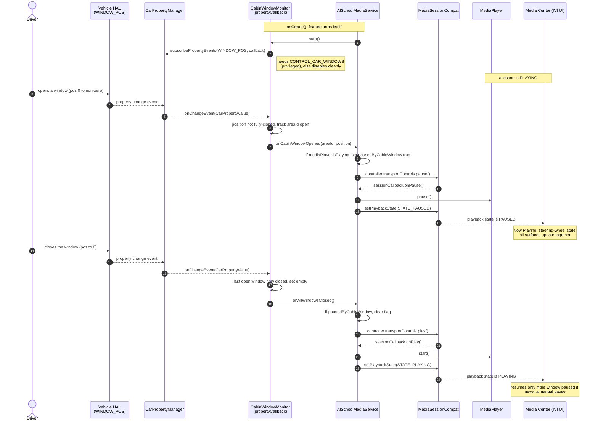
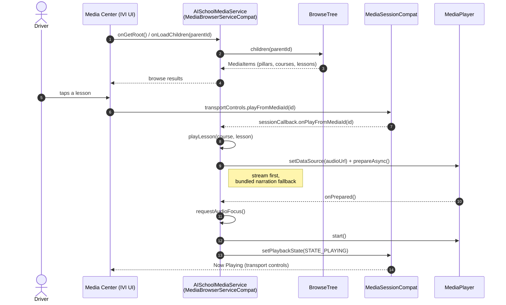
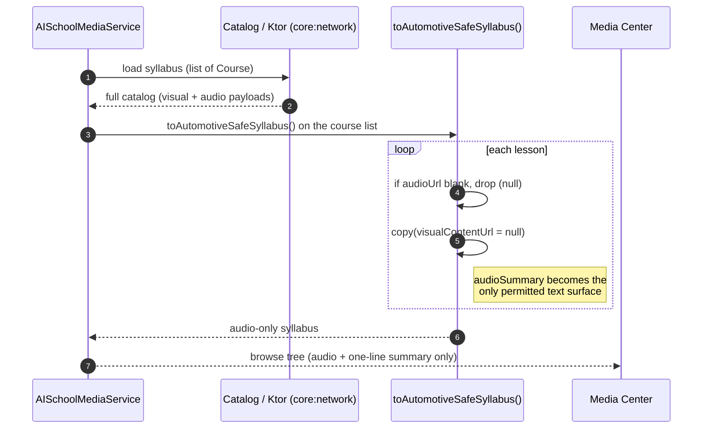

# AI School - Automotive Sequence Diagrams

Sequence diagrams for the three flows that matter in the in-vehicle build. They
use the real class and method names from `:app-automotive` and `:core:model`, so
the diagrams double as a map into the source. Rendered by GitHub natively
(Mermaid).

---

## 1. Window-open auto-pause (the anchor feature)

When any cabin window leaves the fully-closed position, the active lesson is
paused systemically through the media session, not by a local hack. Once every
cabin window is closed again, the lesson resumes automatically. The resume is
guarded: only a lesson the window paused resumes, never one the driver paused by
hand.

Source: `CabinWindowMonitor.kt`, `AISchoolMediaService.kt`.



---

## 2. Lesson playback start

The automotive flavor draws no UI of its own. The car's Media Center binds to the
`MediaBrowserServiceCompat`, renders the browse tree, and drives playback through
the media session.

Source: `AISchoolMediaService.kt`, `BrowseTree.kt`.



---

## 3. Dual-payload content sanitization (safety in the data layer)

The same syllabus serves both surfaces. The moment content heads for the cabin,
the data layer strips every visual payload and drops anything with no audio, so
the browse tree the head unit receives is structurally incapable of presenting
distracting content. Safety is enforced by architecture, not by UI review.

Source: `core/model/AutomotiveSafety.kt`.



---

## How to exercise these on an emulator

See [`RUNNING-AUTOMOTIVE.md`](RUNNING-AUTOMOTIVE.md) and
[`SINGLE_SCREEN_DEMO.md`](SINGLE_SCREEN_DEMO.md) for setup. The window-pause flow
(diagram 1) is triggered with an injected VHAL event while a lesson plays:

```bash
# pause: open a window (any non-zero position)
adb shell cmd car_service inject-vhal-event WINDOW_POS 0x10 3
# resume: close the window again (auto-resumes the window-paused lesson)
adb shell cmd car_service inject-vhal-event WINDOW_POS 0x10 0
```

The debug automotive build is platform-signed (AOSP public test key), so
`CONTROL_CAR_WINDOWS` is granted and the feature runs live on the emulator.
