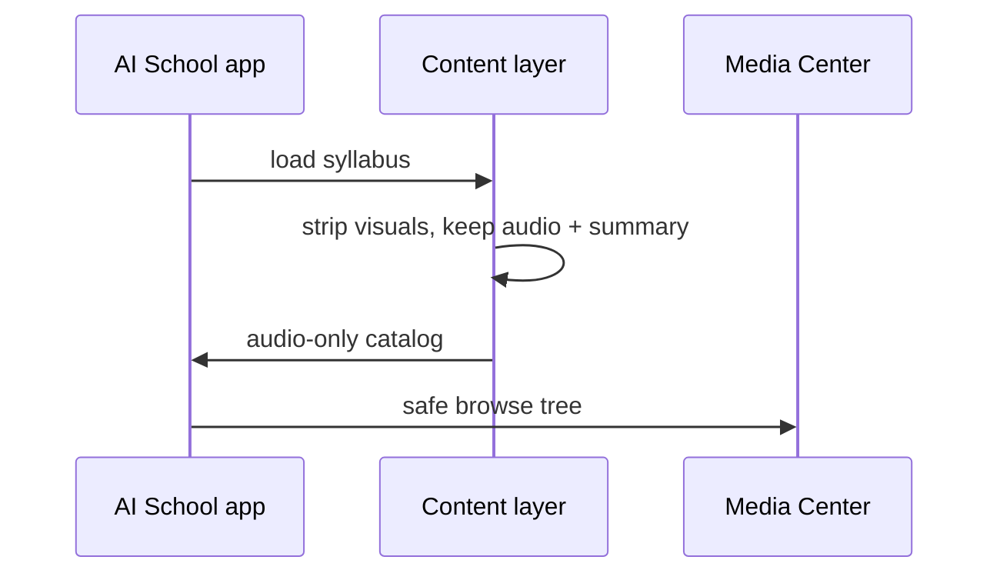
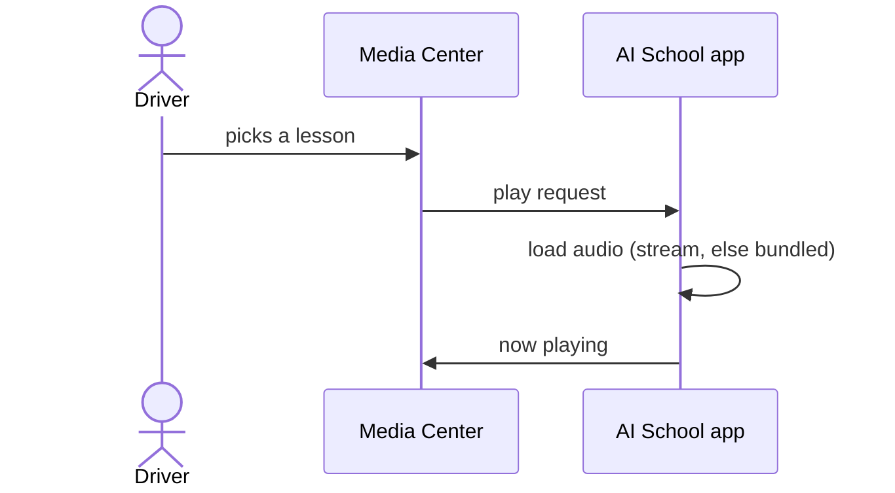
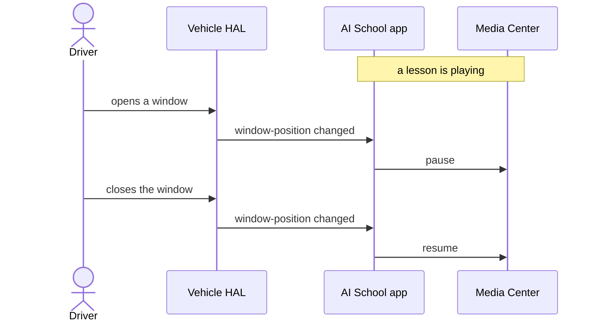

# AI School - Automotive Sequence Diagrams

Three simple flows for the in-vehicle build, in the order they happen: content is
made safe, a lesson plays, then the cabin reacts. Rendered by GitHub natively
(Mermaid).

---

## 1. Content made safe for the cabin

Before content reaches the car, the data layer strips every visual payload and
keeps audio plus a one-line summary.

Source: `core/model/AutomotiveSafety.kt`.



---

## 2. Lesson playback

The car's Media Center drives playback; the app supplies the audio.

Source: `AISchoolMediaService.kt`, `BrowseTree.kt`.



---

## 3. Window-open pause, window-closed resume (the anchor feature)

A lesson pauses the instant a window opens, and resumes once every window is
closed again.

Source: `CabinWindowMonitor.kt`, `AISchoolMediaService.kt`.



---

## Try the anchor feature on an emulator

While a lesson plays:

```bash
adb shell cmd car_service inject-vhal-event WINDOW_POS 0x10 3   # open window -> pause
adb shell cmd car_service inject-vhal-event WINDOW_POS 0x10 0   # close window -> resume
```
