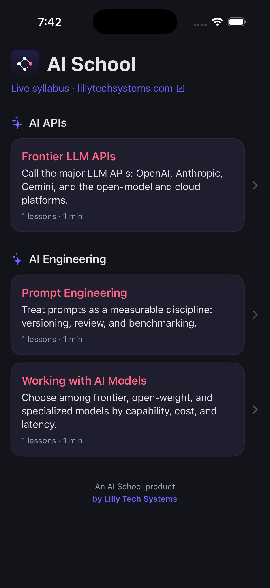
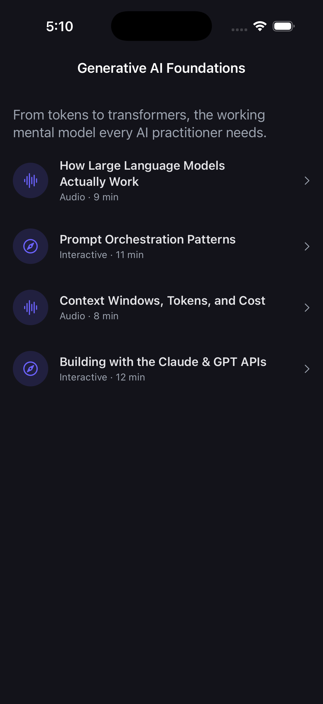
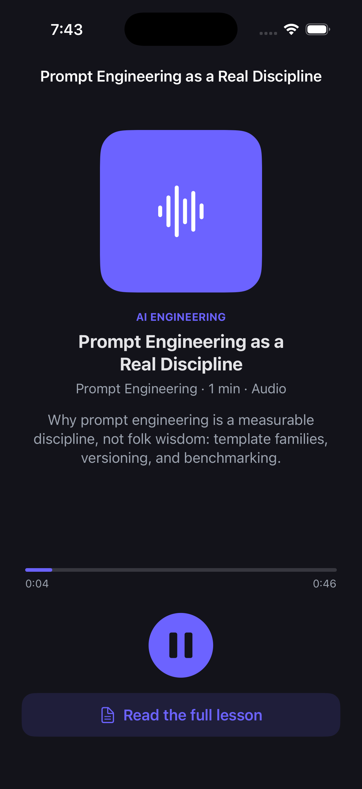
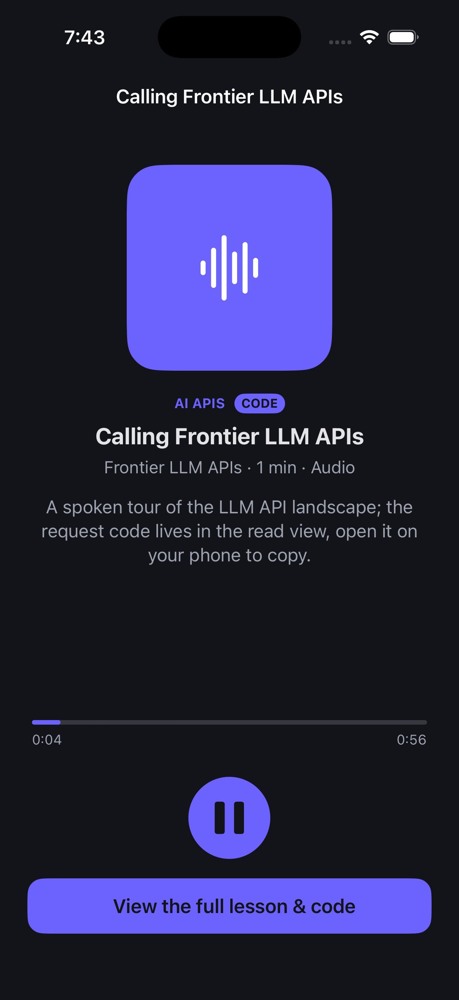
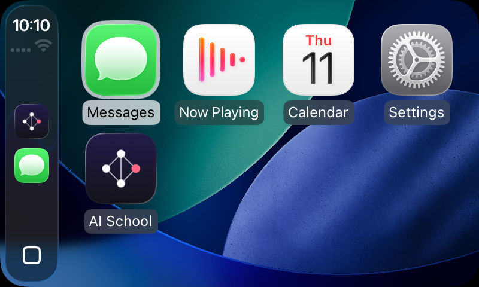

# AI School - iOS (SwiftUI)

A native SwiftUI port of the AI School mobile experience: the same catalog,
courses, and lessons as the Android mobile flavor, driven by the same shared
domain model and the same backend.

Built with the latest toolchain: **Swift 6** (complete strict concurrency),
the iOS 26 SDK, deployment target iOS 18, and App Store submission readiness
(app icon, privacy manifest, encryption-exempt declaration).

## Screenshots

| Catalog (real feed) | Course | Audio lesson | Code lesson + read view |
|---|---|---|---|
|  |  |  |  |

The catalog above is **real AI School content** adapted by the content pipeline
(see [`docs/CONTENT-PIPELINE.md`](../docs/CONTENT-PIPELINE.md)): every lesson is
audio-first, and code-heavy lessons open the real web page to read/copy the code.

## Features

- **Track-first home**: the learning tracks from the live feed as cards, with
  the AI School lockup, a tappable website link, and a Lilly Tech Systems footer.
- **Course detail** with the lesson list and an Audio / Interactive badge per
  lesson.
- **Lesson screen**, two modes that mirror the Android app:
  - *Audio lessons*: a branded player (`AVPlayer`) with progress and play/pause,
    **streaming the audio from the hosted feed**.
  - *Interactive lessons*: the live topic page in a `WKWebView`, with the site's
    global chrome (nav, sidebar, cookie banner) stripped so only the lesson
    content shows.
- **Data**: prefers the live `syllabus.json` feed, falls back to a bundled
  `SeedSyllabus` so the catalog still shows offline (audio streams).
- **Dark-first brand theme** matching the AI School palette.
- **CarPlay** (audio-only, the iOS analog of the Android Automotive flavor),
  see below.

## CarPlay (in the car)



A CarPlay audio scene mirrors the Android Automotive media service: the driver
browses tracks then courses then lessons, every item is audio, and playback
runs through the system Now Playing template and the remote command center
(steering-wheel / dashboard controls). Like the car flavor on Android, only
`isAutomotiveSafe` lessons are listed, code-heavy lessons stay on the phone.

It reuses the same `SyllabusStore` (live feed then seed) and streams the hosted
audio like the phone. The implementation is in [`AISchool/CarPlay/`](AISchool/CarPlay):
`CarPlaySceneDelegate` builds the templates, `CarPlayPlaybackController` drives
`AVPlayer` + `MPNowPlayingInfoCenter`.

**Testing it:** run the app in the iOS Simulator, then in the Simulator menu
choose **I/O > External Displays > CarPlay**. AI School appears on the CarPlay
home screen (above). Selecting a lesson plays it and shows Now Playing.

**Shipping it:** the `com.apple.developer.carplay-audio` entitlement is declared
(`AISchool/Resources/AISchool.entitlements`). It works in the CarPlay Simulator
as-is; releasing to a device or the App Store additionally requires Apple to
grant the CarPlay audio entitlement on the App ID (a one-time request to Apple).

## Structure

```
ios/
  project.yml                 XcodeGen spec (source of truth for the project)
  AISchool/
    App/                      @main app entry
    Model/                    Course, Lesson, Pillars, SeedSyllabus, Endpoints
    Data/                     SyllabusStore (repository), AudioPlayer
    Theme/                    brand palette
    Views/                    CourseList, CourseDetail, Lesson, WebView
    CarPlay/                  CarPlay scene delegate + audio controller
    Resources/                Inter fonts, asset catalog, bundled feed, Info.plist, entitlements
```

## Build and run

Requires Xcode 16+ with an iOS Simulator runtime installed.

```bash
# open in Xcode and press Run, or from the command line:
cd ios
open AISchool.xcodeproj          # then pick an iPhone simulator and Run
```

The committed `AISchool.xcodeproj` is generated from `project.yml`. To
regenerate it after changing sources or settings:

```bash
brew install xcodegen   # one-time
cd ios && xcodegen generate
```

## App Store readiness

The project is set up to submit to the App Store:

- **App icon** (`Assets.xcassets/AppIcon.appiconset`, opaque 1024, no alpha).
- **Privacy manifest** (`PrivacyInfo.xcprivacy`): no tracking, no collected data.
- **Encryption-exempt** declaration (`ITSAppUsesNonExemptEncryption = false`) so
  uploads skip the export-compliance prompt.
- Versioned (`MARKETING_VERSION` 1.0, `CURRENT_PROJECT_VERSION` 1), portrait,
  background-audio capable.

To submit: open the project, set your **Team** under Signing & Capabilities
(automatic signing), then Archive and distribute. Verified to build and run in
the iOS Simulator and type-checks clean under Swift 6 complete concurrency.

## Scope

iPhone plus CarPlay (audio-only). This mirrors the Android repo's split of a
rich phone app and a distraction-safe in-car flavor.
